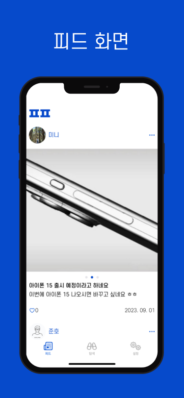
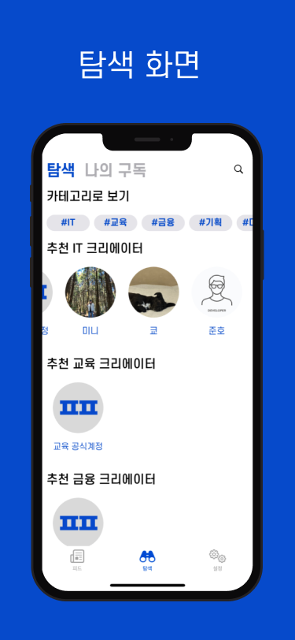
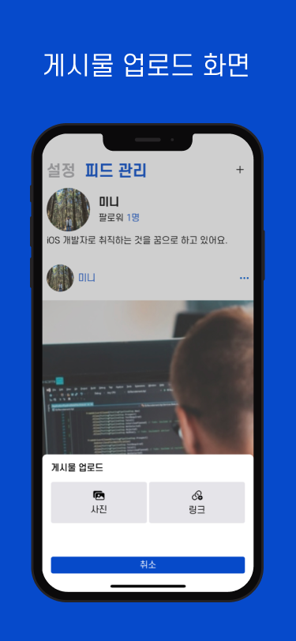

## 팬팔 - 모든 직군의 이야기
 

저희는 모두 직업을 가지고 있습니다. 그 직업에는 10년이 넘은 베테랑도 있고, 1년도 안된 신입도 있습니다. 이들은 모두 같은 직업 내에 존재하지만, 많은 의사소통을 하는 것은 어렵습니다. 특히, 자신이 존경하는 인물에 대해서 요즘 어떤 것에 관심을 두는 지, 어떤 생각을 하는지는 알 수 없을 겁니다. 이런 불편함을 없애기 위해서 10가지 이상의 직업군 기반 SNS앱을 제작하였습니다.

### 기간
- 2023.06.25 ~ 2023.09.02 (2달)
  
    #### 배포 상황
  - 1.0.0 (2023. 09. 02)
  - 1.0.1 (2023. 09. 04)

### 팀원

||||
|:--:|:--:|:--:|
|[코딩중인 쿄](https://github.com/KyoPak)|[디버깅중인 미니](https://github.com/leegyoungmin)|[아이디어가 떠오른 준호](https://github.com/junho15)|

### 개발환경 및 라이브러리
  

| 라이브러리   | 버전   |
| ---------- | ------ |
| RxSwift    | 6.2.0  |
| Kingfisher | 7.7.0  |
| SnapKit    | 5.0.1  |
| Then       | 2.6.0  |
| Mantis     | 2.13.0 |

## 미리보기

| 피드          | 탐색          | 업로드         |
| ------------ | ------------ | ------------ |
|  |  |  |

### 개발 관련 글

[기술 블로그](https://github.com/Young-Child/FanFollow/wiki)
1. [MVVM을 사용하자!](https://github.com/Young-Child/FanFollow/wiki/1.-MVVM%EC%9D%84-%EC%82%AC%EC%9A%A9%ED%95%98%EC%9E%90!)
2. [객체 지향에 기반한 코드 작성](https://github.com/Young-Child/FanFollow/wiki/2.-%EA%B0%9D%EC%B2%B4-%EC%A7%80%ED%96%A5%EC%97%90-%EA%B8%B0%EB%B0%98%ED%95%9C-%EC%BD%94%EB%93%9C-%EC%9E%91%EC%84%B1)
3. [Test Code와 Test 자동화](https://github.com/Young-Child/FanFollow/wiki/3.-Test-Code%EC%99%80-Test-%EC%9E%90%EB%8F%99%ED%99%94)
4. [이미지 라이브러리 비교 및 선택](https://github.com/Young-Child/FanFollow/wiki/4.-%EC%9D%B4%EB%AF%B8%EC%A7%80-%EB%9D%BC%EC%9D%B4%EB%B8%8C%EB%9F%AC%EB%A6%AC-%EB%B9%84%EA%B5%90-%EB%B0%8F-%EC%84%A0%ED%83%9D)
5. [UI 구현 Point](https://github.com/Young-Child/FanFollow/wiki/5.-UI-%EA%B5%AC%ED%98%84-Point)